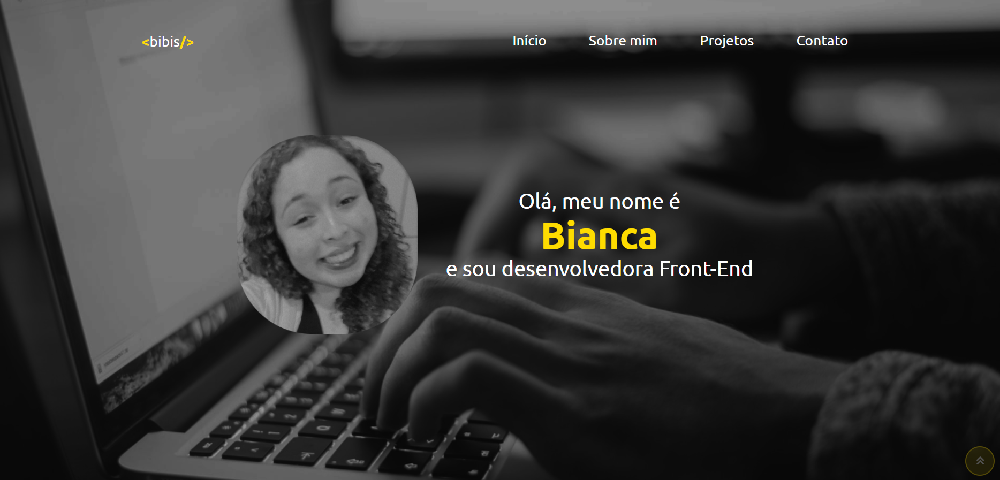

# Portfólio Bianca Leão

---

## Sobre

Portfólio onde apresento técnicas aprendidas no curso senai Desenvolvimento de Sistemas. 
O objetivo deste projeto é colocar em prática os conhecimentos adquiridos no curso do [Senai Jandira](https://jandira.sp.senai.br/). 

---

## Tecnologias Utilizadas

- HTML
- CSS
- Responsividade
- Markdown

## Autor 

- O site foi realizado por mim, [Bianca Leão](https://github.com/leaobia)
- Você pode me contatar através do meu [Linkedin](https://www.linkedin.com/in/bianca-leao-411808227/)